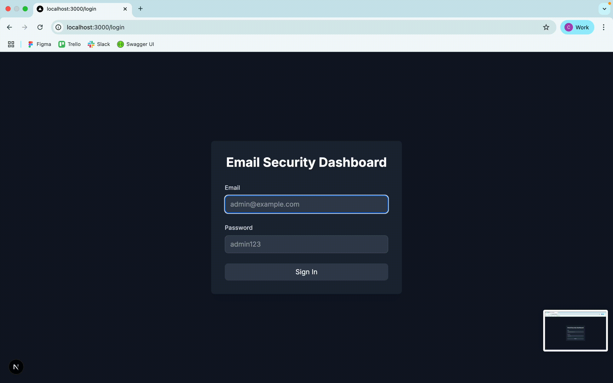
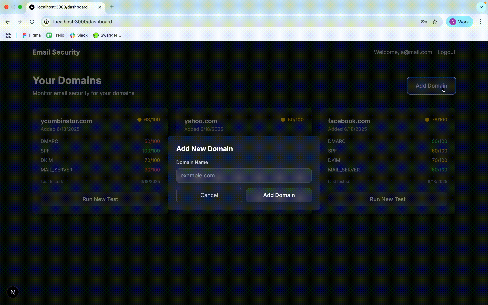
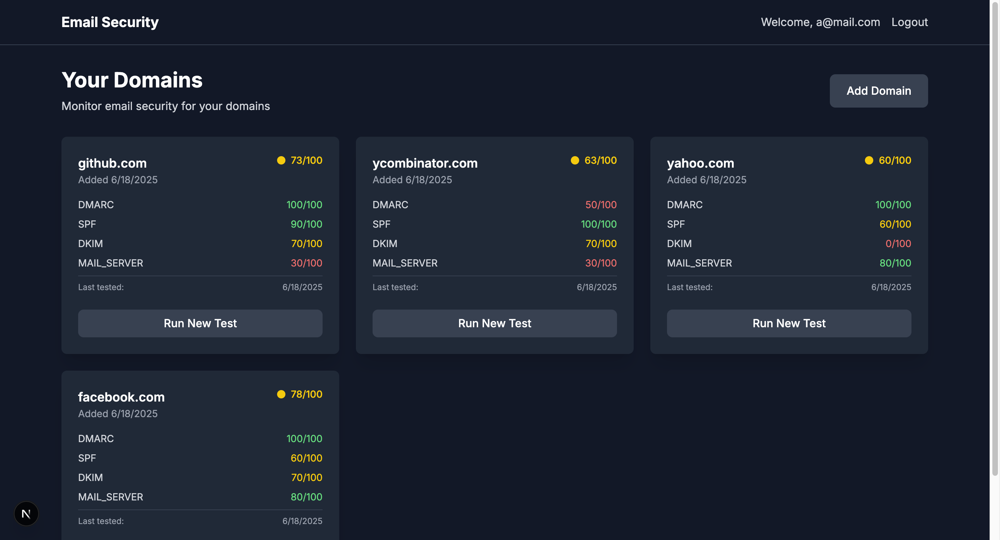

# Email Security Dashboard

A full-stack application to test and monitor email security configurations (DMARC, SPF, DKIM, Mail Server) for domains.

## 🚀 Features

- **Email Security Testing**: Test DMARC, SPF, DKIM, and Mail Server configurations
- **Real-time Updates**: Live progress updates via WebSocket during testing
- **Score & Recommendations**: Get security scores and actionable recommendations
- **Domain Management**: Add and monitor multiple domains
- **Dashboard**: View all domains and their latest test results
- **Dark Mode UI**: Modern, responsive dark theme interface

## 🛠 Tech Stack

**Backend:**

- Node.js + TypeScript + Express
- PostgreSQL database
- Python scripts for DNS/email testing
- WebSocket for real-time updates
- JWT authentication

**Frontend:**

- Next.js 14 + TypeScript
- Tailwind CSS
- Real-time WebSocket integration

## 📋 Prerequisites

- Node.js 18+
- Python 3.8+
- PostgreSQL database (or Supabase)

## 🚀 Quick Start

### Backend Setup

1. **Install dependencies:**

   ```bash
   npm install
   ```

2. **Install Python dependencies:**

   ```bash
   cd src/python
   pip install -r requirements.txt
   ```

3. **Environment variables:**
   Create `.env` file from .env.example:

4. **Database setup:**
   Run `src/database/init.sql` in your PostgreSQL/Supabase

5. **Start backend:**

   ```bash
   npm run dev
   ```

### Frontend Setup

1. **Install dependencies:**

   ```bash
   cd fe-email-security
   npm install
   ```

2. **Environment variables:**
   Create `.env` from `.env.example`:

3. **Start frontend:**

   ```bash
   npm run dev
   ```

## 🔧 Usage

1. **Login:** Use `user@example.com` / `User123.` (default user)
2. **Add Domain:** Click "Add Domain" and enter your domain
3. **Run Tests:** Click "Run Security Test" on any domain card
4. **View Results:** See real-time progress and detailed results
5. **Monitor:** Dashboard shows latest test scores for all domains

## 📡 API Endpoints

- `POST /api/auth/login` - User authentication
- `GET /api/domains` - Get user domains with latest test results
- `POST /api/domains` - Add new domain
- `POST /api/tests/run` - Start security tests
- `GET /api/tests/sessions` - Get test history
- `GET /api/docs` - Swagger documentation

## 🐍 Email Tests

The Python scripts test:

- **DMARC**: Email authentication policy
- **SPF**: Authorized mail servers
- **DKIM**: Email signature validation
- **Mail Server**: SMTP connectivity and MX records

## 🔒 Default Login

- **Email:** user@example.com
- **Password:** User123.

or you can try register new user using swagger docs

## 📊 Dashboard Features

- Domain cards showing latest security scores
- Color-coded results (Green: 80+, Yellow: 60-79, Red: <60)
- Real-time test progress with WebSocket
- Test history and session management
- Responsive dark mode design

## 🎥 Demo Videos

The following demonstration videos showcase the implemented features:

- **Login**: 
- **Add new domain**: 
- **Run test**: 
- **Dashboard**: 

---

Built with ❤️ by Coco 🥥
